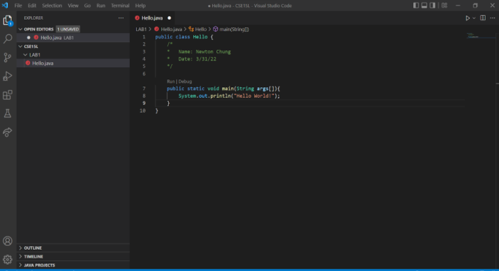
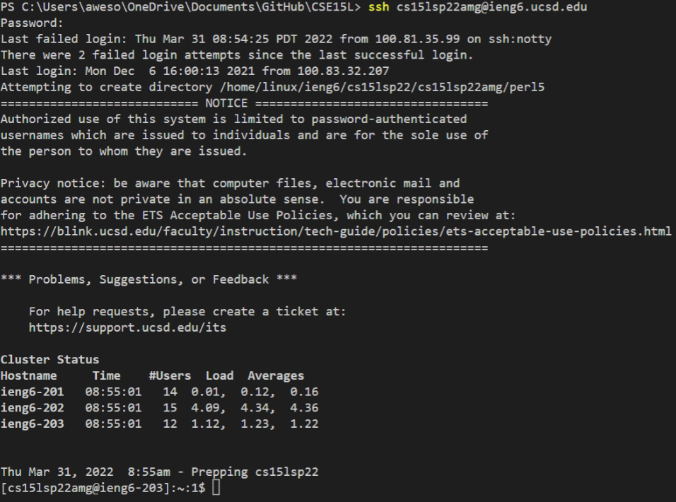
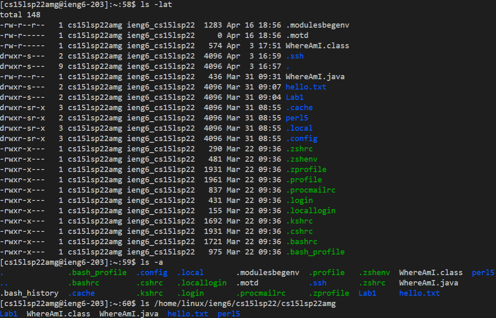
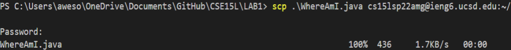
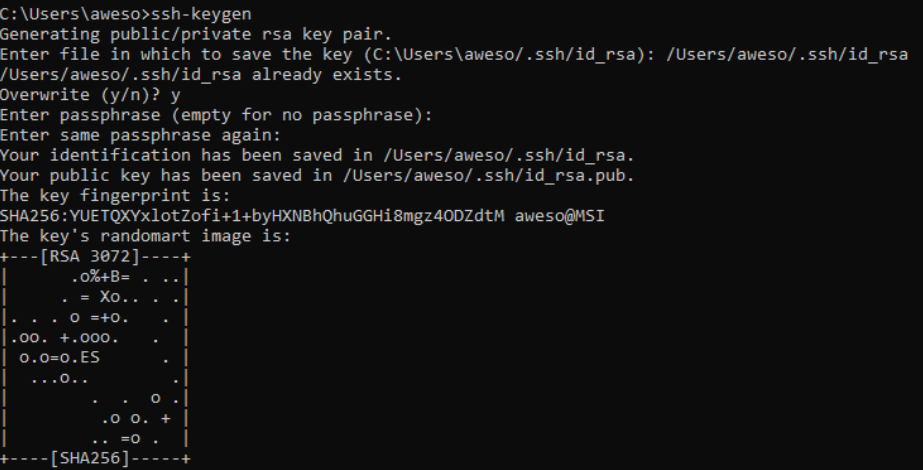
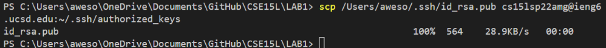
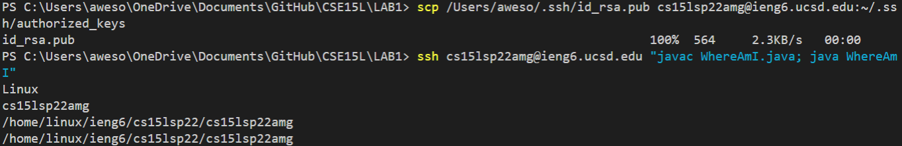

# Lab Report 1:

**Part 1: Meet your group!**

Introduce yourself by stating the following:
  1. Name/nickname + pronouns
  2. One of the following:
    -A UCSD Student Organization you're a member of or interested in
    -What UCSD college you're in
    -Where you're calling in from
  3. One mistake that you've made in the past involving coding/homework/computer stuff

My introduction:
1. Name: Newton  |  Pronouns: he/him/his
2. UCSD college: Eleanor Roosevelt College
3. Comparing strings with "==" instead of .equals()
 

**Part 2: Visual Studio Code**
Everyone share a screenshot of VSCode open!

 

**Part 3: Remotely Connection**
Log into the account, then share a screenshot of the output.

ssh cs15lsp22amg@ieng6.ucsd.edu

 

**Part 4: Run Some Commands**

I ran the following commands: 
cd ---> (Change Directory) 
ls ---> (Listing Directory) 
cp ---> (Copy a file to another directory) 
cat --> (Concatenate)

* cd ~
* cd 
* ls -lat
* ls -a
* ls (directory), where (directory) is /home/linux/ieng6/cs15lsp22/cs15lsp22amg
* cp /home/linux/ieng6/cs15lsp22/public/hello.txt ~/
* cat /home/linux/ieng6/cs15lsp22/public/hello.txt
 

  
**Part 5: Moving Files over SSH with scp**
  
Share a screenshot using SSH and SCP

 
  
**Part 6: SSH Keys**

First, I created a private key pair in my computer.
  

Then, I copied the PUBLIC key into the .ssh directory of my user account on the server.
After doing this, I was able to log in and scp a file over in one step.
  

 

**Step 7: Making Remote Running even more pleasant**

Using techniques shown in class, come up with a way to copy a saved file and run it in under 10 keystrokes.

My solution: (Some file names, usernames have been filled in with my information)
  
$ scp /Users/aweso/.ssh/id_rsa.pub cs15lsp22amg@ieng6.ucsd.edu:~/.ssh/authorized_keys
  
$ ssh cs15lsp22amg@ieng6.ucsd.edu "javac WhereAmI.java; java WhereAmI"

**Step 8: Wrapup**

*Do you have any open questions about things you saw that you don’t understand?*
  
For some reason, scp doesn’t work. After I save the file and try copying it over, the server still only has the older version.

