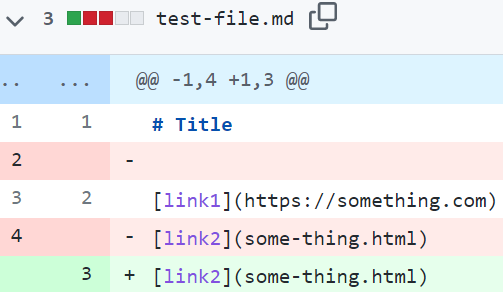

# Lab Report 2

> Pick three code changes that your group worked on in lab 3 in order to fix a bug; these should be stored as commits on
> someone’s repository. Fork the repository so you have your own copy with all the work your group did if you haven’t already.

For future reference, here is the original _test-file.md_.

### Code Change 1:

First the first code change, I added white lines to the file.

[Link to the test file copy](https://github.com/NLChung9/markdown-parser/edit/main/test-file-copy.md)

The symptom of this failure-inducing input was that it caused an infinite loop, before printing this message:

The way that MarkdownParse had originally been written, it would only stop checking for links if the current index surpassed the 
length of the file. However, the current index would only be set to one index after the last closed parenthesis. So, MarkdownParse
would ONLY stop if the closed parenthesis was the last character of the file. For the failed input, the last character was not a
closed parenthesis, resulting in an infinite loop(and crash).

### Code Change 2:

For the second code change, I added a fake link into the file. The fake link contains a pair of brackets followed by a pair of
parentheses, as well as a period between the parentheses. However, it is not a real link.

[Link to the test file copy](https://github.com/NLChung9/markdown-parser/blob/main/test-file-copy2.md)

The symptom of this failure-inducing input was that it treated the fake link as a real one, and printed the wrong output.

MarkdownParse treated any "[brackets](parentheses)" sequence as a link. So, the "[not a link](not a .link)" sequence in the 
failure-inducing input, which did not contain a link, was returned as a link.

### Code Change 3:

For the third code change, I added a pair of brackets into the file that were *not* followed by parentheses. 

[Link to the test file copy](https://github.com/NLChung9/markdown-parser/blob/main/test-file-copy3.md)

Similarly to Code Change 1, this failure-inducing input's symptom caused an infinite loop and a crash.

