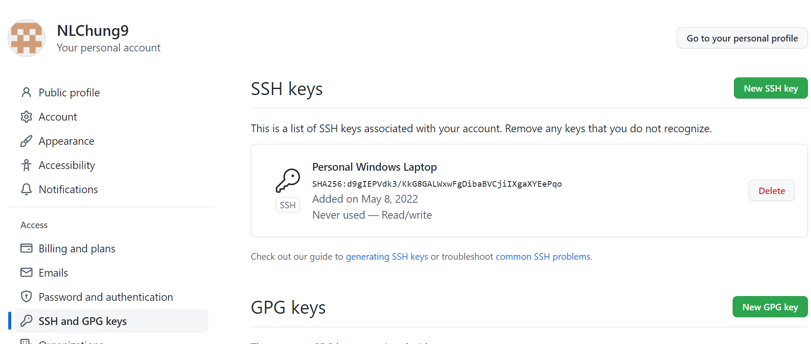

# Lab Report 3

> In this lab report, you will implement all Group Choice Options (1-3) from Lab 5. 
> Complete them for yourself (if you haven’t already), and take the relevant screenshots listed below.
> Create a post with a few sentences of description about all the options available. 
> 
> Create it in a new file called lab-report-3-week-6 so that it gets a new page on your site, 
> and add a link to the page to the index of your site. You will submit it to Gradescope as usual as a few links.

## Streamlining ssh Configuration
- Show your .ssh/config file, and how you edited it (with VScode, another program, etc)

I edited it on VSCode.

- Show the ssh command logging you into your account using just the alias you chose.

I do not know why I am receiving this error. No matter what I input as the password, it fails
(I verified my password on my ieng6 account, but it still doesn't work when logging in here).

- Show an scp command copying a file to your account using just the alias you chose.

## Setup Github Access from ieng6
- Show where the public key you made is stored on Github and in your user account (screenshot).

- Show where the private key you made is stored on your user account (but not its contents) as a screenshot.

- Show running git commands to commit and push a change to Github while logged into your ieng6 account.

The line, "git push origin main" works at first, but when I reach the Password part, my password isn't accepted.
I'm not sure why this error is occurring.

- Show a link for the resulting commit.

Not applicable due to an error involving the "git push origin main" line explained above

## Copy whole directories with scp -r
- Show copying your whole markdown-parse directory to your ieng6 account.

- Show logging into your ieng6 account after doing this and compiling and running the tests for your repository.

- Show (like in the last step of the first lab) combining scp, ;, and ssh to copy the whole directory and run the tests in one line.

For some reason, when I used the scp and ssh commands in this way, I end up hitting a "cannot find symbol" compiler error
that didn't show up when I did the scp and ssh commands separately.
