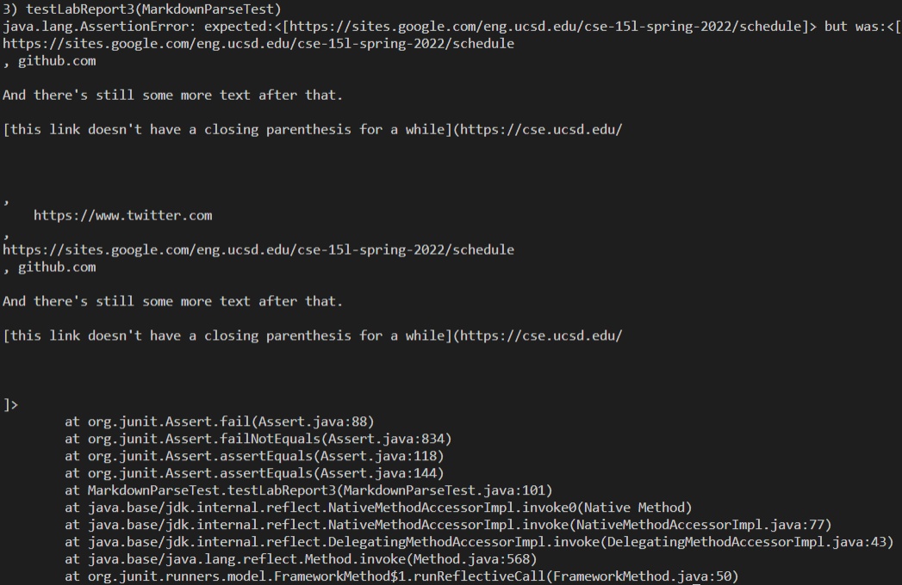

# Lab Report 

[My markdown repository](https://github.com/NLChung9/markdown-parser)

[Markdown repository I reviewed in week 7](https://github.com/MichaelYe48/markdown-parser)

> Consider the following tests:

> 1.  

> 2.  

> 3.  

Expected outputs:
1. [`google.com, google.com, ucsd.edu]
2. [a.com, a.com(()), example.com]
3. [https://sites.google.com/eng.ucsd.edu/cse-15l-spring-2022/schedule]

How I turned the snippets above into tests:  

How the student I reviewed turned the snippets above into tests:  

### Implementation

My implementation: All three tests failed. (T_T)  

His implementation: All three tests failed.  
 
 

**Snippet 1**: This may be a small change in terms of lines of code.
To make the tests with inline ticks work, I would need to scan for any inline ticks that...
- start before the openBracket and end after the openBracket
- start after the openBracket and end after the closedBracket
- start after the closedBracket but before the openParenthesis(no matter where it ends, it breaks the link)

Additionally, if an inline tick starts BETWEEN the open and closed parenthesis and ends AFTER the closedParenthesis,
then the link doesn't break, but I can't treat the tick inside the parentheses as an open tick.

**Snippet 2**: This seems like it might be a larger change in lines of code.
To make tests with nested links, parentheses, and brackets, I would need to make sure that...
- If there are multiple links nested inside each other, only the innermost link will be treated as a link.
- If there are nested parentheses or brackets, that whichever "[]" pair that resides DIRECTLY before a "()" pair becomes part of the link. If the nest is between the brackets, it will show up as part of the link. If the nest is between the parentheses, it will become part of the URL.

There are many ways to write nested parentheses or brackets that break the code, so adding fixes for all of those cases might be more than 10 lines.

**Snippet 3**: This may be a small change in terms of lines of code.
- If there are any line breaks within the brackets or the parentheses, then the link is broken.

