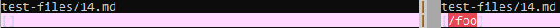
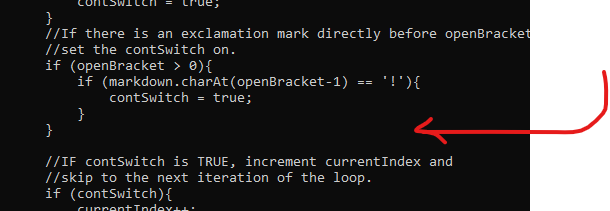
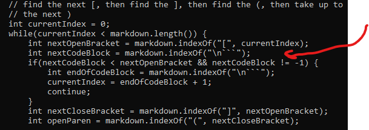
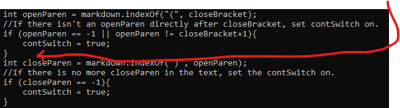
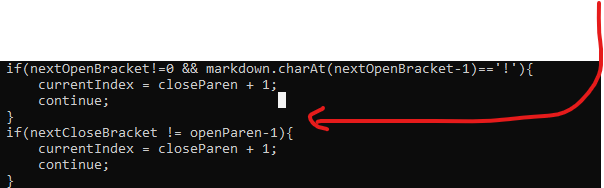

# Lab Report 5

> In lab 9, you experimented with the many tests provided under the test-files/ folder. 
> For this lab report, choose any two tests from the 652 tests where your implementation 
> (or a representative implementation from your group) had different answers than the 
> implementation we provided for lab 9. The tests with different answers should correspond 
> to different bugs – that is, you couldn’t easily fix both with one code change.

I found the two tests by using vimdiff on the results of bash script.sh, where script.sh 
refers to a file that runs MarkdownParse on all 652 tests. Vimdiff highlighted the tests
and results that differed in between the programs, so I sifted through the tests and found
two differences that correspond to different coding mistakes.

Links to the two test files:

[Test file #14](https://github.com/nidhidhamnani/markdown-parser/blob/main/test-files/14.md)

[Test file #491](https://github.com/nidhidhamnani/markdown-parser/blob/main/test-files/491.md)

### Test file #14
Correct output: [] 
My output: [] 
Clone's output: [/foo] 

Both mine and the clone's implementations fail to recognize that when a bracket-parentheses pair "" 
is preceded by a backslash, it doesn't count as a link. Code that would check the character in front of the
openBracket(i.e. "charAt(openBracket-1) == \") should be inserted in these spots.

My implementation:

Clone's implementation:

My implementation yielded the correct result, but for the wrong reason. I coded it so that a link would not
count unless there was a period between the parentheses, but this is actually incorrect.

### Test file #491
Correct output: [<b)c>] 
My output: [] 
Clone's output: [<b] 

The clone's output was incorrect because the code cut off the link's URL at a closed parenthesis that was contained in a "<>" pair.
My code had this same error in addition to the error mentioned previously where it didn't count URLS without periods. After the open
parenthesis, the code should check for "<", and upon finding one, should discount any closed parenthesis until reaching an instance of ">".

Code that checks for instances of "<" and ">" should be located in between the parts where the code finds the open and closed parentheses.

My implementation:

Clone's implementation:

