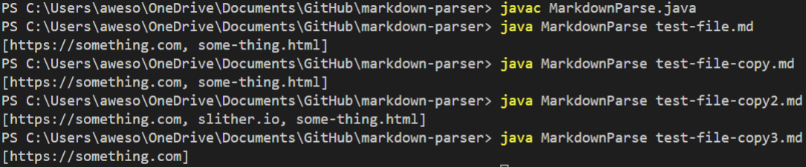

# Lab Report 4

> Clone (or pull, if it’s your repository) the repository with your group’s code from the last lab. You should have the original provided test file test-file.md, and three other test files that you wrote as part of the last lab.
 

**Part 1: Your Memory**
> Run the program on one of the examples you wrote last week. Is the output correct? How do you know?

Yes, the output is correct. According to the instructions from the last lab, we needed to create a method that returned every link that was present in a given markdown file. The program successfully returned a list of all the links that were in the markdown file. 

> **Write in notes**: what process did your team go through to justify that the output was correct? Did you remember what it was supposed to be or did you have to open the file to verify?

I had to open the program and the markdown files in VSCode in order to verify that the returned list matched all of the links that were present in each markdown file.
 

**Part 2: Running via Command Line**
> Have someone in the group open VScode with the markdown parser project along with their terminal open. They should make a small edit to the program (like adding a print statement in main).
> 
> Start a timer, then have them recompile the program and run the program on all of the test files (there should be at least 4 total), then stop the timer.
> 
> **Write in notes**: How long did this take?

It took me ~15 seconds.

> These two issues—remembering what the correct result ought to be, and the work involved in re-running tests one-by-one—motivate using _automated testing tools_. There are lots of choices we could make here. We’re going to start by using JUnit not least because it is representative of many similar tools, and sees widespread use in large software projects.
> For this part of the lab, you’ll install JUnit and use it to write a test program that solves the problems of having to remember what “correct output” is and taking a lot of manual effort to re-run many tests.
 

**Part 3: Setting up Junit**
> Download these two .jar files. 
> [junit-4.13.2.jar](https://github.com/nidhidhamnani/markdown-parser/blob/main/lib/junit-4.13.2.jar) 
> [hamcrest-core-1.3.jar](https://github.com/nidhidhamnani/markdown-parser/blob/main/lib/hamcrest-core-1.3.jar)
> 
> Then, make a directory called lib in your project, and copy both of those files to that directory. Commit and push the files once they are added to lib (this is a useful step because it ensures that you see them in your repository!)
> 
> In the .gitignore file, delete "*.jar".
> 
> Next, create a file called MarkdownParseTest.java in your repository. Put the following code in the file:
> import static org.junit.Assert.*;
> import org.junit.*;
> public class MarkdownParseTest {
>     @Test
>     public void addition() {
>         assertEquals(2, 1 + 1);
>     }
> }
> Compile the test using:
> javac -cp ".;lib\junit-4.13.2.jar;lib\hamcrest-core-1.3.jar" MarkdownParseTest.java
> Run the test using:
> java -cp ".;lib/junit-4.13.2.jar;lib/hamcrest-core-1.3.jar" org.junit.runner.JUnitCore MarkdownParseTest

The output of the command was the following:
JUnit version 4.13.2
.
Time: 0.007

OK (1 test)

